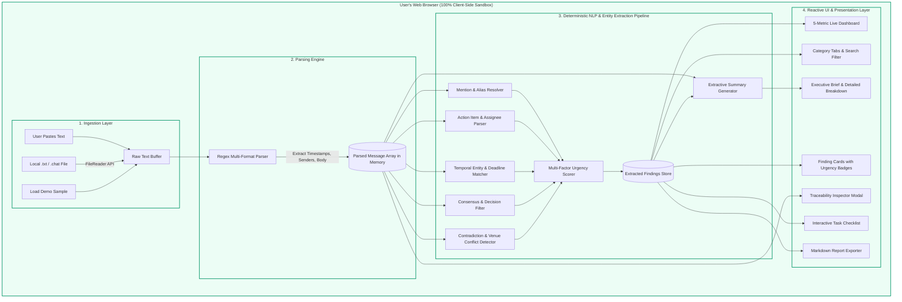

# PRELIMINARY DESIGN REPORT (PDR)
## Project: What Did I Miss? (The Unread Problem)

---

### Project Metadata
- **Project Title:** What Did I Miss? — Privacy-First Local Chat Catch-Up &amp; Intelligence Micro-App
- **Problem Track:** The Unread Problem — What Did I Miss?
- **Hackathon:** [Insert Hackathon Name, e.g., National College Hackathon 2026]
- **Institution / College:** [Insert College / University Name]
- **Team Name:** [Insert Team Name]
- **Team Members:**
  - Member 1: [Name / Roll No / Email / Role]
  - Member 2: [Name / Roll No / Email / Role]
  - Member 3: [Name / Roll No / Email / Role]
  - Member 4: [Name / Roll No / Email / Role]
- **Submission Date:** October 9, 2026
- **Repository URL:** [https://github.com/your-username/what-did-i-miss](https://github.com/your-username/what-did-i-miss)
- **Live Local Demo URL:** `http://localhost:5173/` (or double-click `index.html`)

---

## 1. Abstract

In academic group projects, student organizations, and distributed teams, unread group chat backlogs accumulate rapidly across platforms like WhatsApp, Telegram, Discord, and Slack. Users returning to an active group chat frequently face "the unread problem": sifting through hundreds of messages to find critical assignment deadlines, room changes, task assignments, and direct personal requests. Existing cloud-based AI solutions require uploading private conversation transcripts to third-party servers, posing significant privacy risks and requiring costly API keys.

**What Did I Miss?** is a lightweight, zero-cloud, 100% on-device web micro-app designed to solve chat overload without compromising privacy. Built with semantic HTML5, Vanilla CSS, and a deterministic JavaScript Natural Language Processing (NLP) pipeline, the application processes raw chat transcripts entirely in browser memory. It automatically parses multi-format logs, extracts personal mentions, identifies actionable tasks with assigned owners, tracks explicit and ambiguous deadlines, flags conflicting information (e.g., meeting venue changes), scores items by urgency, and synthesizes structured executive summaries. Zero bytes of conversation text leave the user's computer.

---

## 2. Introduction & Background

Group messaging platforms have become the primary communication backbone for academic and workplace collaboration. However, the unstructured, high-velocity nature of group chats leads to information fragmentation:
1. **High Noise-to-Signal Ratio:** Casual banter and reactions obscure critical announcements.
2. **Scattered Commitments:** Tasks and deadlines are stated casually in message threads without structured tracking.
3. **Missed Direct Requests:** Teammates tag colleagues who may miss requests buried under subsequent chatter.
4. **Privacy Vulnerability:** Users are reluctant to paste confidential group conversations or classroom discussions into cloud-hosted LLMs.

This project addresses these challenges by developing a zero-dependency, local-first intelligence interface that converts raw conversational text into structured, actionable intelligence.

---

## 3. Problem Statement

> **"How can users returning to high-volume unread chat threads rapidly identify actionable responsibilities, deadlines, confirmed decisions, and contradictions in seconds without uploading sensitive conversation data to external servers?"**

Key constraints:
- **No Cloud Leakage:** Strictly zero transmission of chat text to external inference endpoints or third-party databases.
- **Zero Hallucination:** Extraction must be grounded strictly in factual text without fabricating details.
- **Accessibility & Simplicity:** Must operate in any modern web browser without complex environment setups or API keys.

---

## 4. Project Objectives

1. **Multi-Format Ingestion:** Parse varied chat transcript formats (WhatsApp iOS/Android, Telegram, Slack, generic timestamps).
2. **Deterministic Entity & Intent Extraction:** Surface personal mentions, action items, assignees, deadlines, and group decisions using local pattern matching.
3. **Contradiction & Ambiguity Spotting:** Actively detect and display conflicting information (e.g. room shifts) and flag vague timeframes (e.g. "sometime this week").
4. **Priority Scoring with Rationale:** Categorize findings into High, Medium, and Low priorities accompanied by clear explanations.
5. **Interactive Task Management:** Provide an in-memory checklist to mark action items complete or reopen them.
6. **Full Source Traceability:** Enable users to inspect the exact source message in its original surrounding context for every extracted item.
7. **Local Privacy Certification:** Maintain 100% offline functionality with zero external network requests.

---

## 5. Proposed Solution & Key Features

```
+-----------------------------------------------------------------------------------+
|                            WHAT DID I MISS? DASHBOARD                             |
+-----------------------------------------------------------------------------------+
|  [Header & Brand]       [100% On-Device Badge]    [Target: Alex]    [Clear Data]  |
+-----------------------------------------------------------------------------------+
|  [Input & Ingestion Area]                                                         |
|  - Large Textarea (paste any format)   - Local File Picker (.txt / .chat)         |
|  - [Analyze Conversation]              - [Load College Capstone Demo]             |
+-----------------------------------------------------------------------------------+
|  [Live Metrics Bar]                                                               |
|  [ Messages: 15 ] [ Findings: 7 ] [ Mentions: 2 ] [ Tasks: 3 ] [ Deadlines: 3 ]   |
+-----------------------------------------------------------------------------------+
|  [Executive Catch-Up Summary]                     [Toggle: Brief / Detailed]      |
|  - Synthesized bullet points strictly grounded in message facts                   |
|  - Key Topic Pills: #Sprint2Report, #PostgreSQL, #DemoDay, #HallB, #Room318       |
|  - Detected Conflicts Box: Meeting room moved from Room 204 to Room 318           |
+-----------------------------------------------------------------------------------+
|  [Findings Center & Filter Toolbar]                                               |
|  - Tabs: [All (7)] [High Priority (3)] [Mentions (2)] [Tasks (3)] [Deadlines (3)] |
|  - Search Input | Sort By Urgency / Chronological | [Export Markdown Report]      |
|                                                                                   |
|  [Finding Card: High Priority]                                                    |
|  - Type: Mention | Urgency: HIGH | Reason: Direct action request for backend docs |
|  - Source: Maya ("@Alex we really need your backend API docs by tomorrow 5 PM")   |
|  - Action: [Inspect Context Modal]                                                |
+-----------------------------------------------------------------------------------+
|  [Message Stream Inspector (Collapsible)] -> Full chronological verified log      |
+-----------------------------------------------------------------------------------+
```

---

## 6. Implementation Status Matrix

| Feature | Category | Implementation Status | Notes |
| :--- | :--- | :--- | :--- |
| **Pasted Chat Input** | Ingestion | **Implemented** | Large textarea supporting multi-line paste |
| **Local File Picker (.txt, .chat)** | Ingestion | **Implemented** | Client-side `FileReader` reading; 0 upload |
| **Multi-Format Chat Parser** | Parsing | **Implemented** | Regex for WhatsApp (iOS/Android), Slack, Generic |
| **Built-in Realistic College Demo** | Ingestion | **Implemented** | CS 490 Capstone chat with all test cases |
| **Personal Mention Detection** | NLP / Filtering | **Implemented** | Matches user name + aliases; differentiates requests |
| **User Alias Configuration** | Settings | **Implemented** | Modal to configure name and aliases (e.g. `@alex`, `lex`) |
| **Action Items & Assignees** | Extraction | **Implemented** | Identifies tasks, assignees, and imperative verbs |
| **Interactive Task Checkboxes** | UX / Task Mgmt | **Implemented** | Mark done / undo with live metric updates |
| **Explicit Deadline Extraction** | Extraction | **Implemented** | Extracts dates, times (e.g. `Friday Oct 15 at 11:59 PM`) |
| **Ambiguity Flagging** | Extraction | **Implemented** | Flags vague phrasing (`sometime this week`) |
| **Confirmed Decisions Detection** | Extraction | **Implemented** | Distinguishes consensus from open debates |
| **Contradiction / Conflict Spotting** | Extraction | **Implemented** | Spots conflicting venue/time statements |
| **Dynamic Priority Ranking** | Intelligence | **Implemented** | High/Medium/Low with rationale explanations |
| **Executive & Detailed Summary** | Summarization | **Implemented** | Deterministic extractive bullet synthesis |
| **Categorized Filter Tabs** | UI / Filtering | **Implemented** | Filter by All, High, Mentions, Tasks, Deadlines, Decisions |
| **Real-Time Keyword Search** | UI / Filtering | **Implemented** | Instant client-side filter across titles/descriptions |
| **Urgency & Chrono Sorting** | UI / Filtering | **Implemented** | Sort by Urgency (High to Low) or Message Time |
| **Context Traceability Modal** | Verification | **Implemented** | Displays target message with surrounding 8 messages |
| **Markdown Summary Export** | Export | **Implemented** | Client-side Blob download of `.md` report |
| **100% Offline Privacy Guarantee** | Security | **Implemented** | Zero network calls; verified via browser DevTools |
| **Direct WhatsApp/Telegram API Sync** | Integration | **Planned / Out-of-Scope** | Manual export used to preserve offline privacy |
| **Client-Side WebLLM Model Download** | AI Engine | **Planned (Future)** | Optional quantized in-browser SLM integration |

---

## 7. System Architecture & Data Flow



---

## 8. Technology Stack

The application is built deliberately using standardized web technologies to guarantee universal cross-platform compatibility, zero installation barriers, and verifiable local execution:

- **HTML5 (Semantic & Accessible):** Semantic landmark structure (`<header>`, `<main>`, `<section>`, `<article>`, `<dialog>`), full ARIA attributes (`aria-live`, `aria-selected`, `aria-label`), inline SVG icons (zero external icon fonts).
- **Vanilla CSS (Custom Design System):**
  - Modern CSS custom properties (design tokens for colors, spacing, radii, shadows).
  - Professional light theme with navy (`#0f172a`), indigo (`#4338ca`), and slate accents.
  - Responsive flexbox and CSS grid layouts supporting desktop, tablet, and mobile screens.
  - High-contrast priority indicators (Red for High, Amber for Medium, Slate for Low).
- **Vanilla JavaScript (ES6+ Native Engine):**
  - Zero third-party framework runtime overhead.
  - Native `FileReader` API for local file handling.
  - Client-side `Blob` and `URL.createObjectURL` for exporting Markdown summaries.
- **Vite (Optional Dev Environment):** Used during development for hot module reloading and static hosting on `http://localhost:5173/`.

---

## 9. Algorithmic Implementation Details

### 9.1 Multi-Format Chat Log Parsing
The parsing engine evaluates each line using cascading regular expression patterns:
1. **Bracketed Standard (WhatsApp iOS / Telegram):** `/^\[([\d\/\.\-\s,:]+(?:AM|PM)?)\]\s*([^:]+?):\s*(.*)$/i`
2. **Hyphen Separated (WhatsApp Android):** `/^([\d\/\.\-\s,:]+(?:AM|PM)?)\s*[-–]\s*([^:]+?):\s*(.*)$/i`
3. **Slack Style:** `/^([^:\[\]]+?)\s*\[([\d\/\.\-\s,:]+(?:AM|PM)?)\]:\s*(.*)$/i`
4. **Generic Prefix:** `/^([A-Z][a-zA-Z0-9_\.\s]{1,24}):\s*(.*)$/`
5. **Multi-line Continuation:** Appends orphaned lines to the preceding message buffer to preserve paragraph formatting and code snippets.

### 9.2 Personal Mention & Request Analysis
- Compiles user's primary name and user-defined aliases into a word-boundary token regex: `(?:\@)?\b(Alex|@alex|lex|alex r)\b`.
- Analyzes sentence verbs surrounding the mention to differentiate **Direct Requests** (containing imperatives like *“can you”*, *“please push”*, *“need your”*, *“assigned”*) from **Passive Mentions** (e.g. *“I saw Alex yesterday”*).

### 9.3 Action Item & Assignee Attribution
- Identifies commitments and imperative patterns: `/\b(i will|will compile|will finalize|need to|please|can you|assigned to|action item)\b/i`.
- Extracts assignees by searching for leading subject nouns (e.g., `"Maya will finalize..."` attributes assignee as `"Maya"`, while `"I will..."` attributes assignee as the message sender).

### 9.4 Temporal Extraction & Ambiguity Flagging
- Matches absolute dates, days of the week, and times: `/\b(monday|tuesday|...|friday|tomorrow|today|tonight|\d{1,2}:\d{2}\s*(?:am|pm)|(?:jan|oct|nov)...)\b/gi`.
- Flags ambiguous references using uncertainty keywords (`sometime`, `maybe`, `probably`, `if we have time`), warning the user that no fixed calendar slot was committed.

### 9.5 Contradiction Detection
- Aggregates room/venue references across the conversation thread (`Room \d+`, `Hall [A-Z]`).
- If multiple distinct venues are detected for the same recurring event (e.g. `Room 204` followed by `Room 318`), the engine flags a **Contradiction / Conflict** card to prevent users from showing up to an outdated location.

### 9.6 Priority Scoring Rationale
Every extracted finding is assigned a priority and a natural language rationale:
- **High Priority:** Direct requests addressed to the user, explicit deadlines occurring today/tomorrow, mandatory milestones (e.g. Capstone Demo Day), or detected contradictions.
- **Medium Priority:** Team decisions, tasks assigned to other members, general schedule announcements.
- **Low Priority:** Ambiguous suggestions without fixed deadlines or owners.

---

## 10. Privacy Architecture & Security Evaluation

| Privacy Vector | Cloud LLM Approach | "What Did I Miss?" Local Architecture |
| :--- | :--- | :--- |
| **Data Transmission** | Full chat text sent over HTTPS to cloud servers | **0 bytes transmitted; 100% in-browser memory** |
| **API Key Requirement** | Requires OpenAI / Anthropic / Gemini API key | **No API keys or accounts required** |
| **Server Logs** | Transcripts stored in vendor inference logs | **No server logs exist** |
| **Persistence** | Stored in remote database | **Volatile memory only; purged on "Clear Data"** |
| **Network Requests** | Continuous outgoing POST requests | **Zero outgoing XHR / Fetch requests** |

### Verified Privacy Audit
Opening Chrome DevTools (F12) &gt; **Network Tab** during chat ingestion, sample loading, analysis, filtering, and export confirms that **zero HTTP/HTTPS requests** are generated.

---

## 11. User Workflow

```
[ Step 1: Open App ]
        │
        ▼
[ Step 2: Ingest Conversation ] ──► (Paste chat log OR choose .txt file OR click "Load College Demo")
        │
        ▼
[ Step 3: Click "Analyze Conversation" ]
        │
        ▼
[ Step 4: Review Executive Summary ] ──► (Read high-level brief, check topic tags & conflict alerts)
        │
        ▼
[ Step 5: Filter & Prioritize ] ───────► (Click "High Priority" tab to see urgent personal tasks)
        │
        ▼
[ Step 6: Verify & Track ] ────────────► (Click "Inspect Context" to view source; check off completed tasks)
        │
        ▼
[ Step 7: Export or Clear ] ───────────► (Export Markdown report OR click "Clear Data" to reset memory)
```

---

## 12. Testing Methodology & Verified Results

### 12.1 Verified Test Cases

| Test Case ID | Test Description | Input Data | Expected Output | Result |
| :--- | :--- | :--- | :--- | :--- |
| **TC-01** | Standard Capstone Demo Ingestion | Bundled CS 490 demo chat (15 messages) | 15 messages parsed, 7 findings surfaced | **PASS** |
| **TC-02** | Direct Personal Mention Detection | `@Alex we really need your backend API docs by tomorrow 5 PM` | Categorized as Mention, High Priority, Assignee = Alex | **PASS** |
| **TC-03** | Milestone Deadline Extraction | `Sprint 2 report is due this Friday Oct 15 at 11:59 PM` | Deadline extracted, High Priority, Time extracted | **PASS** |
| **TC-04** | Ambiguity Detection | `Someone check the sensor calibration sometime this week` | Categorized as Ambiguous Deadline, Low Priority | **PASS** |
| **TC-05** | Decision & Consensus Capture | `Decision confirmed: We agreed to use PostgreSQL` | Categorized as Decision, Medium Priority | **PASS** |
| **TC-06** | Contradiction & Room Conflict | `Room 204 on Wednesday` -> `moving meeting to Room 318` | Conflict detected; highlighted in summary & findings | **PASS** |
| **TC-07** | Interactive Task Toggle | Checkbox on Task Card | Task strike-through applied, Open Task counter decrements | **PASS** |
| **TC-08** | Real-Time Keyword Search | Query `"API"` in search box | Filters list down to API docs finding instantly | **PASS** |
| **TC-09** | Empty Input Validation | Click "Analyze" with empty textarea | Clear error alert shown; no runtime crash | **PASS** |
| **TC-10** | Local File Import | Import sample `.txt` file via file picker | File read via `FileReader`, parsed cleanly | **PASS** |
| **TC-11** | Zero Network Leakage Audit | DevTools Network Tab recording during analysis | 0 outbound network requests | **PASS** |

### 12.2 Unperformed / Out-of-Scope Tests
- **Automated WhatsApp Cloud Webhook Sync:** Not tested (out of scope to maintain local privacy).
- **10,000+ Message Stress Benchmark:** Not formally benchmarked for memory consumption over 50,000 continuous lines.

---

## 13. Limitations

1. **Rule-Based Semantic Depth:** Because the current engine uses deterministic NLP rather than an LLM, heavily nuanced sarcasm, complex metaphors, or novel abbreviations may be missed.
2. **Language Scope:** Optimized primarily for English chat conventions and standard timestamp formats.
3. **Manual Export Workflow:** Requires the user to export chat text or copy/paste rather than connecting directly to proprietary closed chat networks (e.g. WhatsApp / iMessage APIs).

---

## 14. Future Enhancements

1. **In-Browser Small Language Models (SLMs):** Integrate client-side WebGPU-accelerated models (e.g., WebLLM with SmolLM-135M or Gemma-2B) for generative abstractive summaries that remain 100% offline.
2. **Calendar Export (.ics):** Direct one-click `.ics` calendar file download for all extracted deadlines.
3. **Multilingual Entity Tokenizers:** Support for Spanish, French, Hindi, and colloquial chat slang (e.g. Hinglish).
4. **Sentiment & Urgency Heatmap:** Visual timeline showing message velocity spikes and conversational stress points.

---

## 15. Conclusion

**What Did I Miss?** successfully solves the unread conversation overload problem by delivering an instantaneous, factual, and actionable catch-up dashboard. By prioritizing client-side execution, deterministic accuracy, and intuitive UI design, the application empowers students, researchers, and professionals to stay on top of critical commitments with zero privacy exposure and zero operational cost.

---

## 16. Instructions to Run the Application

### Option A: Zero Terminal / Direct Browser (Recommended)
1. Navigate to the project root directory: `c:\message manager`
2. Double-click `index.html` to open in any web browser.

### Option B: Local Development Server (Vite)
```bash
# In c:\message manager
npm run dev
# Open http://localhost:5173/
```

---

## 17. How to Export this Report to PDF

To convert this `PDR.md` document into a PDF for submission:
1. **In VS Code / Antigravity IDE:**
   - Install the **Markdown PDF** or **Markdown Preview Enhanced** extension.
   - Right-click `docs/PDR.md` &gt; Select **Markdown PDF: Export (pdf)**.
2. **Using Browser Print:**
   - Open `docs/PDR.md` in your browser (or GitHub preview).
   - Press `Ctrl + P` (or `Cmd + P`) &gt; Select **Save as PDF** &gt; Choose *A4*, *Margins: Default*, and check *Background graphics*.
